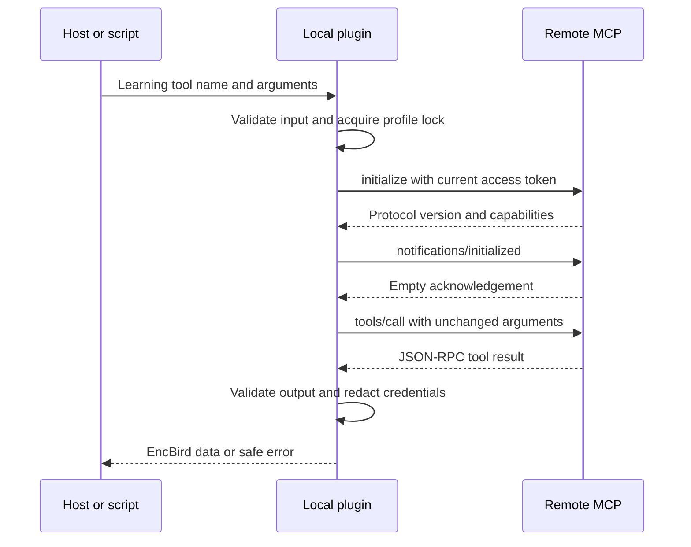

# Remote MCP transport contract

The installed plugin remains a local Node process for Codex or Claude Code. Its 15 learning tools call `https://api.encbird.com/mcp` through Streamable HTTP, the MCP transport that carries protocol messages in HTTP requests. The script runner uses the same implementation. Tool names, arguments, consent requirements and learning-result schemas remain unchanged.

## Endpoints and authentication

`https://api.encbird.com/v1/mcp-learning` remains the base for public configuration and connection lifecycle operations: `GET /config`, `POST /connections`, `DELETE /connection` and `POST /connection/revoke-previous`. These operations are handled by the runtime; they are not additional learning tools.

The configuration supplies the OAuth issuer, client ID, authorization/token/revocation endpoints, resource, scopes and redirect URI. The registered callback is exactly `http://localhost:18765/oauth/callback`. The plugin checks discovery metadata, uses PKCE S256, validates callback state and verifies the ID token's signature, issuer, audience, expiry and nonce. Identity comes from this verified grant, never an agent-supplied user ID.

The deployed resource is `https://api.encbird.com/mcp`. Required scopes are `openid` and `https://api.encbird.com/mcp/learning.read`; writes additionally require `https://api.encbird.com/mcp/learning.write`. The configuration must not introduce extra or duplicate scopes. Each outgoing MCP request obtains the current access token from the authenticated runtime. An ID token is for identity verification and must not replace the access token. The MCP grant does not grant access to general web APIs.

A development override may select an explicit loopback HTTP lifecycle base. The remote endpoint is always `/mcp` on that same origin, regardless of the lifecycle path. Production URL overrides, ambiguous URLs, credentials in URLs, query strings and fragments are rejected. There is no arbitrary remote URL or token input.

## Request and result contract

Each learning invocation creates a stateless MCP client connection, negotiates a supported protocol version through `initialize`, sends `notifications/initialized`, and sends one `tools/call`. The tool name and complete validated arguments are forwarded unchanged. A successful invocation normally sends three POST requests; local tool discovery does not query the service.

POST requests use `Content-Type: application/json` and `Accept: application/json, text/event-stream`. This client requires JSON responses without server sessions. It declines the client library's optional server-sent events (SSE) probe locally without opening a stream, rejects `mcp-session-id` headers and streaming responses, and checks that each JSON-RPC response matches the request ID. Notification acknowledgements must have an empty body and status 200, 202 or 204. Responses are limited to 1 MiB, with a 15-second timeout per HTTP request.

Successful tool results contain an EncBird envelope such as `{"data":{"dataSource":"encbird","cefrLevel":"B1"}}` in `structuredContent`; a single JSON text content block is also accepted when structured content is absent. The envelope must pass the tool's output schema. The local MCP response returns matching structured and text JSON. For complete inputs and outputs, use [tools.json](../plugins/encbird/contracts/tools.json) and [serialization examples](../plugins/encbird/contracts/serialization-samples.json).

## Failure, retries and request limits

The shared profile lock spans negotiation, token refresh and the tool result. Each attempted learning HTTP request, including initialization and its notification, consumes the persisted 60-request rolling 60-second budget and is spaced by at least 250 ms. Configuration, browser login and connection cleanup retain their finite lifecycle workflows outside this budget. These are client controls per profile, not service-wide quotas.

HTTP 429 and 503 preserve `Retry-After` as `error.retryAfterSeconds`, accepting seconds or an HTTP date and using 30 seconds when absent or invalid. The pause survives a failed or incomplete response body and process restart. During the pause, learning requests are rejected locally with `REQUEST_THROTTLED`. MCP errors retain safe domain codes while withholding diagnostic text and credentials.

There is no automatic write retry, alternate URL, or learning REST fallback. After an ambiguous write, an explicit retry must keep the complete original arguments and operation key. HTTP 401 expires the local access token so a subsequent explicit attempt can refresh it. `CONNECTION_INACTIVE` disables access and runs existing cleanup; fresh same-account sign-in is needed to create a new connection. `encbird_disconnect` confirms completion only after the connection and provider grant are revoked.

The local bridge owns browser authentication. This contract does not claim automatic OAuth onboarding for arbitrary clients that connect directly to the remote URL, and does not add a password-login tool or accept secrets from a conversation.
