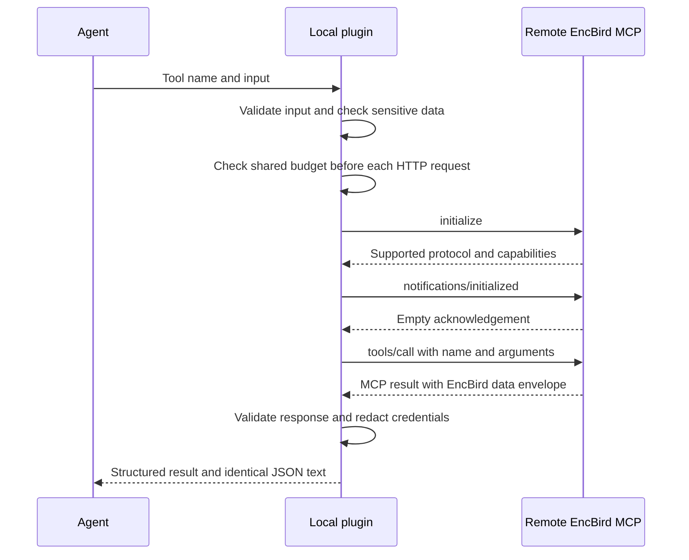

# Plugin runtime and configuration

The plugin forwards learning tool calls to EncBird's remote MCP endpoint at `https://api.encbird.com/mcp`. Account configuration and connection lifecycle requests retain the `/v1/mcp-learning` HTTP API. The connected agent explains questions and provides answer feedback; the plugin itself does not call a language model.

## Runtime components

The agent communicates with a local Node process over standard input and output using MCP (Model Context Protocol, a protocol for calling external tools). [index.ts](../plugins/encbird/src/index.ts) starts the process, and [server.ts](../plugins/encbird/src/server.ts) handles tool listing and invocation.

The bundled [script runner](../plugins/encbird/skills/encbird-learning/scripts/encbird.mjs) is an alternative entry point for deterministic shell calls. Both entry points use [runtime.ts](../plugins/encbird/src/runtime.ts), so scripts keep the same authentication, tool validation, and safe result handling as MCP. The runner supports single calls and read-only plans of at most five sequential calls, validates plan schemas before execution, and stops on the first error. See [Server access](../plugins/encbird/skills/encbird-learning/references/server-access.md) for commands and authentication scope.

Relative to the plugin directory, each configuration points to the following executable:

| Configuration | Executable argument |
| --- | --- |
| `plugin.json` and `mcp.json` | `${PLUGIN_ROOT}/dist/index.js` |
| `.codex-plugin/plugin.json` | `${PLUGIN_ROOT}/dist/index.js` |
| `.claude-plugin/plugin.json` and `.mcp.json` | `${CLAUDE_PLUGIN_ROOT}/dist/index.js` |

Every configuration uses `node` as the command. The agent substitutes the installation path for the root variable. Load one `encbird` server rather than registering each compatibility configuration as a separate server. Both repository marketplace configurations point to `plugins/encbird`.

## Tool calls

[tools.ts](../plugins/encbird/src/tools.ts) validates input and sends each learning tool name and its unchanged arguments through the remote MCP transport. The bundled route metadata determines read-only classification; it does not select a REST fallback. Unsupported tools and invalid input are rejected before a request is sent. Tools that submit learning evidence also pass through the input checks in [privacy.ts](../plugins/encbird/src/privacy.ts).

The following sequence shows a learning tool call after the account connection is established. EncBird API is represented only by its public request and response boundary.

[remote.ts](../plugins/encbird/src/remote.ts) negotiates MCP and validates stateless JSON responses. [api.ts](../plugins/encbird/src/api.ts) continues to handle connection lifecycle responses. Both transports reject redirects and never switch endpoints after a failure. See the [remote MCP transport contract](remote-mcp.md) for request ordering, authentication and result handling. `server.ts` returns identical JSON in `structuredContent` and text, and sets `isError` for errors.

When retrying a write whose result is unknown, preserve the same input and operation key. The key identifies retries as the same operation; its field name and constraints come from each tool's public schema. The learning skill reports a save only when confirmed by the tool result.

[traffic.ts](../plugins/encbird/src/traffic.ts) spaces outgoing learning HTTP requests by 250 ms and admits at most 60 attempts in a rolling 60-second window. MCP initialization, its notification, and the tool request each count toward this limit; one successful tool call normally uses three attempts. History is persisted under the existing credential lock, so MCP and script processes using the same authentication profile share the budget. HTTP 429 and 503 responses preserve safe server error codes and add `error.retryAfterSeconds`, honoring either form of `Retry-After` or using 30 seconds when it is absent or invalid. Subsequent learning calls return `REQUEST_THROTTLED` during that pause without contacting the service. Neither entry point automatically retries an HTTP request.

These are per-profile client guardrails, not service-wide quotas. Separate profiles and machines have separate budgets. Authentication and revocation use their existing finite workflows and do not consume the learning-request budget. Server-side controls are still required to enforce aggregate load limits.

## Account connections and local storage

`encbird_connect` starts browser sign-in and returns `authentication_pending`. Call it again after the learner finishes signing in to confirm `connected`. The plugin uses OAuth, a standard for obtaining access through user authorization, and does not accept tokens directly from the agent. It verifies the configured discovery endpoints before sign-in, uses PKCE S256 to bind the login code to the initiating process, and verifies the returned ID token. Learning requests carry the access token for the MCP resource and the required learning scopes; web login tokens are not interchangeable with this grant.

`encbird_disconnect` blocks local learning access before performing cleanup. Retry if cleanup is incomplete, and report completion only after `disconnected`. When reauthentication is required, have the learner sign in to the same account in the browser. Cancelled sign-in or sign-in to a different account does not complete recovery. Agents must not read credential files or delete pending records.

[store.ts](../plugins/encbird/src/store.ts) keeps credentials in a user-private directory outside the installed plugin. Directory permissions are `0700` and file permissions are `0600`. Storage uses file access controls rather than operating-system keychain encryption. File replacement and token refresh are protected by a lock shared across processes; requests that cannot acquire the lock receive a retryable error. Use a local disk for credential storage.

## Runtime configuration

Normal installation requires no environment variables. For development or separate profiles, configure these values in the plugin process environment:

| Environment variable | Behavior |
| --- | --- |
| `ENCBIRD_API_BASE_URL` | Defaults to `https://api.encbird.com/v1/mcp-learning`. Overrides must be loopback HTTP URLs including the API path. The learning transport derives `/mcp` from that origin, independently of the configured lifecycle path. Loopback addresses refer to the current execution environment: `localhost`, `127.0.0.1`, or `[::1]`. URL credentials, query strings, fragments, and HTTPS overrides are rejected. |
| `ENCBIRD_CREDENTIALS_DIR` | Defaults to `~/.encbird-plugin`. Use an actual absolute path to a local directory owned by and accessible only to the current user. Do not use symbolic links or the installed plugin directory. |
| `ENCBIRD_AUTH_SCOPE` | A stable name separating authentication storage by agent or profile. Defaults to the agent name from MCP initialization, or `unknown-mcp-client` if no name is available. Assign distinct values when different profiles report the same name. |

The script's default client name is `encbird-script`; it does not silently reuse another host's login. Set an explicit, stable `ENCBIRD_AUTH_SCOPE` in both entry points only when intentionally sharing a profile. Do not rotate scopes to evade request limits.

URL validation is implemented in [config.ts](../plugins/encbird/src/config.ts); credential paths and profile separation are implemented in `store.ts`. There is no environment variable setting for supplying API keys or authentication tokens.
